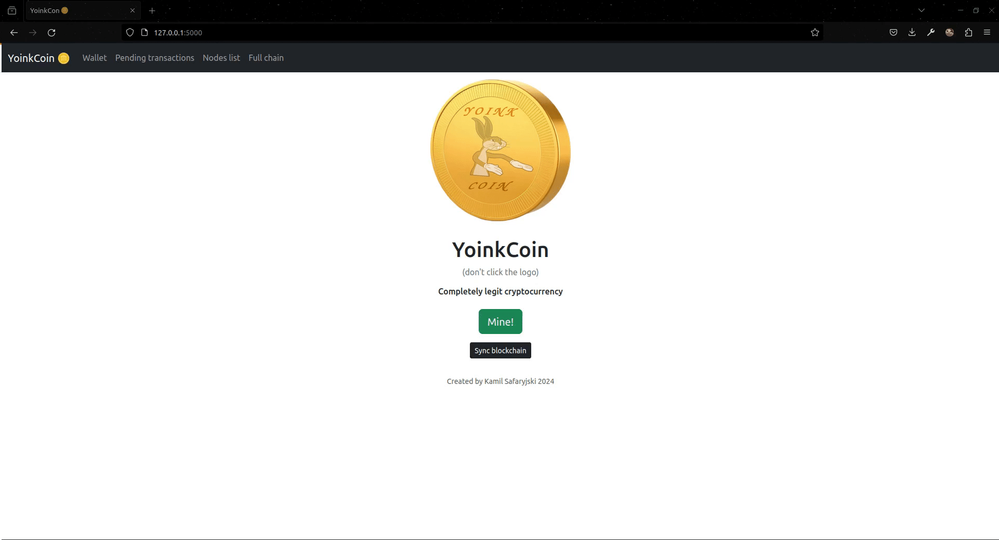
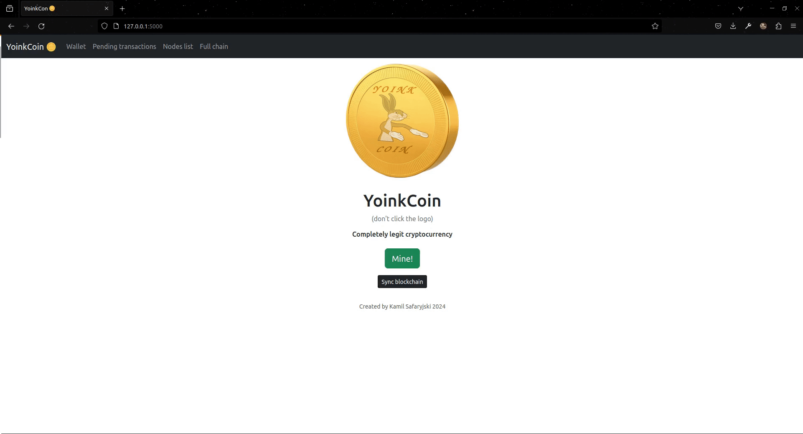
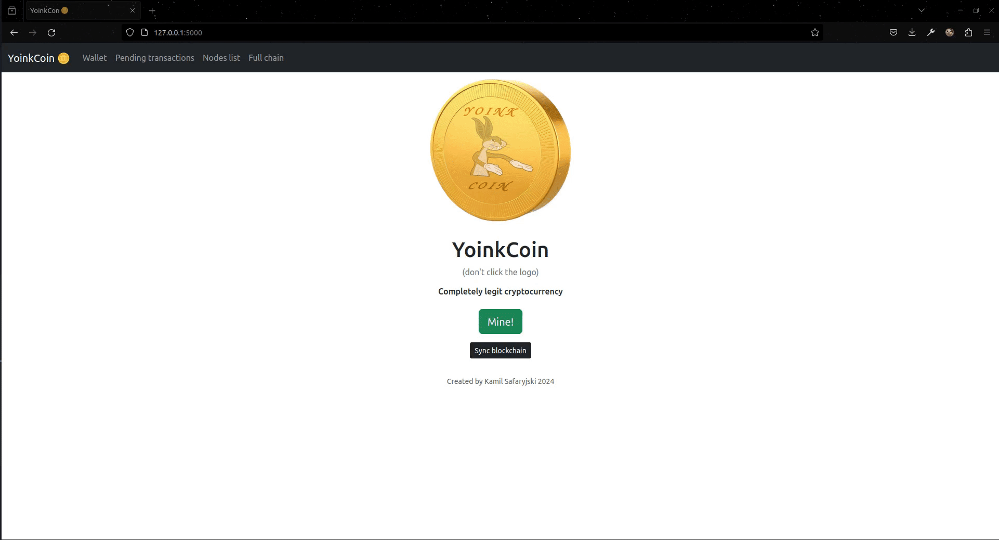
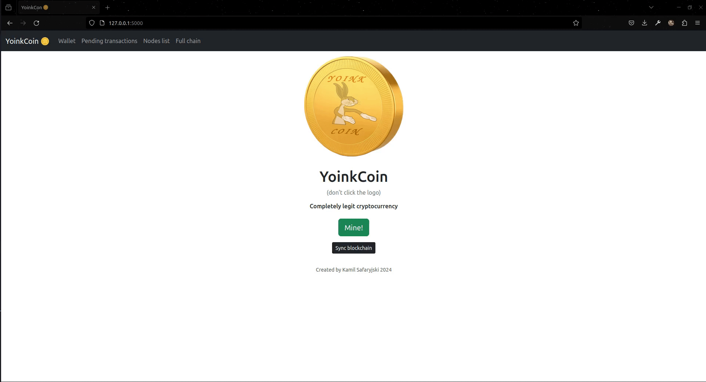

<div align="center">
  
        <h1>YoinkCoin</h1>
        </a>
      
</div>


## Description

Blockchain cryptocurrency application created for Cryptography classes.
This application offers both GUI and API interfaces for interaction with the blockchain.

<p align="center"></p>

YoinkCoin allows users to create new transactions and save them in mined blocks in a blockchain architecture.


## Technologies and tools used:

- Python 3.10
- Flask 3.0.3,
- requests 2.31.0,
- JavaScript,
- Bootstrap5 5.3.3
- gunicorn 22.0.0,
- Docker


## How to install (for Linux, macOS)

Create Python virtual environment, for example:

        virtualenv venv

Activate virtual environment:

        source venv/bin/activate

Run this command to install required dependencies

        pip install -r requirements.txt


## How to run

To start application run in development mode:

        python app.py

Instead, to start <a href="https://gunicorn.org/">gunicorn</a> production server use:
        
        gunicorn -b 0.0.0.0:5000 app:app


## GUI Demo GIFs


***Block mining***
<p align="center"></p>


***Transaction creation***
<p align="center"></p>


***Nodes registration***
<p align="center"></p>


***Sync blockchain***
<p align="center"></p>


***Subpage overview***
<p align="center"></p>

## API Endpoints


| **METHOD** &nbsp;&nbsp;&nbsp;&nbsp;&nbsp;&nbsp;&nbsp;&nbsp;&nbsp;&nbsp;&nbsp;&nbsp;&nbsp;&nbsp;&nbsp;&nbsp;&nbsp;&nbsp;&nbsp;&nbsp;&nbsp;&nbsp;&nbsp;&nbsp;&nbsp;&nbsp;&nbsp;&nbsp;&nbsp;&nbsp;&nbsp; | **ENDPOINT** | **ACTION** | ***Parameters*** |
| ------------- | ------------- | ------------- | ------------- |
| ```/api``` | ```GET``` | Returns list of avaible endpoints. | N/A |
| ```/api/transactions``` | ```GET``` | Returns list of currently pending transactions. | N/A |
| ```/api/nodes``` | ```GET``` | Returns list of registered endpoints. | N/A |
| ```/api/nodes/resolve``` | ```GET``` | Syncs this nodes blockchain with registered nodes. | N/A |
| ```/api/chain``` | ```GET``` | Returns full blockchain. | N/A |
| ```/api/wallet``` | ```GET``` | Returns wallet state of this node. | N/A |
| ```/api/mine``` | ```GET``` | Mines new block. | N/A |
| ```/api/transactions/new``` | ```POST``` | Adds new pending transaction to the blockchain. | ```sender```, ```recipient```, ```amount``` |
| ```/api/nodes/register``` | ```POST``` | Registers new node address. | ```nodes``` |
| ```/api/testing/grant``` | ```POST``` | ***TESTING*** Grants 100 YoinkCoins to this node.  | N/A |


## Containerization (Docker)

YoinkCoin is available in a form of Docker image at <a href="https://hub.docker.com/repository/docker/kamsaf42/yoinkcoin/general">Dockerhub repository</a>.

To use it, install Docker on your system and run following commands:

        docker pull kamsaf42/yoinkcoin:latest
        docker run --name yoinkcon -p 5000:5000 kamsaf42/yoinkcoin:latest

YoinkCoin image when started runs with <a href="https://gunicorn.org/">gunicorn</a> production server on port 5000.

<hr>

Created by Kamil Safaryjski 2024
